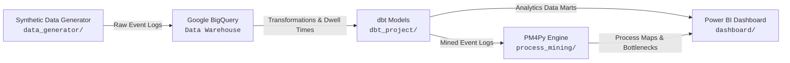

# CareFlow: Clinical Pathway Process Mining System

[](https://www.python.org/)
[](https://www.getdbt.com/)
[](https://pm4py.fit.fraunhofer.de/)
[](https://powerbi.microsoft.com/)

**CareFlow** is an enterprise-grade healthcare analytics and clinical process mining platform. It enables hospital administrators, clinicians, and health informatics teams to extract, transform, analyze, and visualize end-to-end patient encounter event logs to identify operational bottlenecks, reduce Length of Stay (LoS), and optimize patient care pathways.

---

## 🏗️ Architecture & Technology Stack



- **Data Generation**: Modular Python simulation framework modeling realistic patient arrival distributions, activity durations, and intentional operational rework loops.
- **Data Warehousing**: **Google BigQuery** as the scalable, cloud-native enterprise analytical warehouse.
- **Data Transformation (ELT)**: **dbt** for staging, trace deduplication, transition matrix construction, and KPI modeling.
- **Process Mining Engine**: **PM4Py** for process discovery (DFG, Inductive Miner), throughput heatmaps, and conformance checking.
- **Business Intelligence**: **Power BI** for interactive clinical operations dashboards and executive bottleneck monitoring.

---

## 📁 Repository Structure

```text
infotact-careflow-analytics/
├── data/                       # Generated raw and processed event datasets
│   └── raw_event_logs.csv
├── data_generator/             # Synthetic patient log generator module
│   ├── generate_logs.py
│   └── README.md
├── dbt_project/                # dbt models, seeds, and schema tests
│   └── README.md
├── process_mining/             # PM4Py discovery, conformance, & bottleneck scripts
│   └── README.md
├── dashboard/                  # Power BI report templates & DAX measures
│   └── README.md
├── docs/                       # Technical architecture & clinical workflow design
│   ├── event_schema.md
│   └── README.md
├── .gitignore                  # Git ignore rules for Python, dbt, and credentials
├── requirements.txt            # Python dependencies
└── README.md                   # Main project overview
```

---

## 🚀 Quick Start (Day 1)

### 1. Prerequisites
- Python 3.10+
- `pip` package manager

### 2. Setup Environment
```bash
# Clone the repository
git clone https://github.com/your-org/infotact-careflow-analytics.git
cd infotact-careflow-analytics

# Install dependencies
pip install -r requirements.txt
```

### 3. Generate Clinical Event Logs
Run the synthetic event generator to create 150 simulated patient journeys with realistic timestamps and an embedded 40% X-Ray $\rightarrow$ Triage rework bottleneck:
```bash
python data_generator/generate_logs.py
```
*Output is generated at `data/raw_event_logs.csv`.*

### 4. Review Process Documentation
Detailed clinical pathway flows and process mining schema requirements can be found in [`docs/event_schema.md`](./docs/event_schema.md).

---

## 📈 Roadmap
- [x] **Day 1**: Project scaffolding, event schema specification, documentation, and synthetic data generation.
- [ ] **Phase 2**: BigQuery data loading & dbt staging/intermediate transformation modeling.
- [ ] **Phase 3**: PM4Py process discovery, Directly-Follows Graph (DFG) generation, and throughput bottleneck extraction.
- [ ] **Phase 4**: Power BI dashboard construction with interactive variance analysis.
