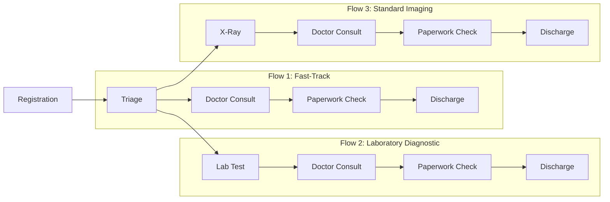
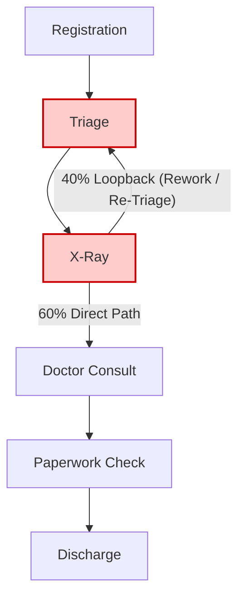

# CareFlow Event Log Schema & Hospital Process Design

## 1. Process Mining Event Log Schema

In process mining, an **event log** captures the discrete chronological actions executed within an operational system. To extract process maps, discover bottleneck paths, and compute performance metrics using **PM4Py**, the dataset adheres to the standardized event log schema defined below.

### Standard Column Definitions

| Column Name | Data Type | Requirement Level | Description & Clinical Context |
| :--- | :--- | :--- | :--- |
| `Case_ID` | `VARCHAR / STRING` | **Mandatory** | Unique patient encounter/journey identifier (e.g., `PAT-0001`). Groups all discrete steps into an end-to-end clinical trace. |
| `Activity_Name` | `VARCHAR / STRING` | **Mandatory** | Standardized clinical or administrative step completed (e.g., `Registration`, `Triage`, `X-Ray`). |
| `Timestamp` | `TIMESTAMP / ISO-8601` | **Mandatory** | Exact date and time when the activity was executed or completed (format: `YYYY-MM-DD HH:MM:SS`). |

---

## 2. Why This Schema is Required for PM4Py Process Mining

PM4Py (Process Mining for Python) and standard process mining algorithms require this exact minimum tripartite structure:

1. **Trace Reconstruction (`Case_ID`)**:
   - Process mining operates on *traces* (ordered sequences of events belonging to a single process instance). 
   - `Case_ID` links disparate events across clinical systems (EHR, PACS, LIS) into one coherent patient journey.
2. **Control-Flow Graph Construction (`Activity_Name`)**:
   - Algorithms such as the **Inductive Miner**, **Heuristics Miner**, and **Directly-Follows Graphs (DFG)** identify transitions from activity $A$ to activity $B$ by reading consecutive event pairs.
3. **Temporal Ordering & Throughput Mining (`Timestamp`)**:
   - Timestamps establish strict causal order ($Event_n \rightarrow Event_{n+1}$).
   - They allow PM4Py to calculate **sojourn times**, **waiting times**, and **total case lead times**, converting a static log into an active bottleneck heat map.

---

## 3. Sample Patient Trace

Below is a sample chronological event sequence for a single patient journey (`PAT-0042`) undergoing diagnostic imaging and physician evaluation:

| Case_ID | Activity_Name | Timestamp | Activity Duration | Cumulative Elapsed Time |
| :--- | :--- | :--- | :--- | :--- |
| `PAT-0042` | `Registration` | `2026-09-01 08:30:00` | 10 mins | 0h 00m |
| `PAT-0042` | `Triage` | `2026-09-01 08:52:00` | 18 mins | 0h 22m |
| `PAT-0042` | `X-Ray` | `2026-09-01 09:40:00` | 35 mins | 1h 10m |
| `PAT-0042` | `Doctor Consult` | `2026-09-01 10:35:00` | 25 mins | 2h 05m |
| `PAT-0042` | `Paperwork Check`| `2026-09-01 11:15:00` | 15 mins | 2h 45m |
| `PAT-0042` | `Discharge` | `2026-09-01 11:38:00` | 10 mins | 3h 08m |

---

## 4. Hospital Process Design

### 4.1 Master Clinical Activity Catalog

| Activity | Department / Role | Operational Objective |
| :--- | :--- | :--- |
| **`Registration`** | Patient Access / Front Desk | Patient identity verification, insurance capture, and electronic check-in. |
| **`Triage`** | Nursing Staff / Emergency Dept | Acuity scoring (e.g., ESI level), vital signs assessment, and clinical routing. |
| **`X-Ray`** | Radiology / Diagnostic Imaging | Radiographic examination, image acquisition, and preliminary technician review. |
| **`Lab Test`** | Pathology / Central Lab | Blood/specimen collection, panel processing, and automated diagnostic analyzer output. |
| **`Doctor Consult`** | Attending Physician | Clinical assessment, diagnosis formulation, and treatment/discharge decision. |
| **`Paperwork Check`**| Administrative / Care Coord. | Discharge summary sign-off, billing clearance, and follow-up prescription verification. |
| **`Discharge`** | Outpatient / Departure Ward | Patient departure instructions, hand-off completion, and bed status update. |

---

### 4.2 Normal Patient Clinical Pathways (Happy Paths)

#### Pathway 1: Fast-Track Clinical Consultation (Low Acuity)
- **Sequence**: `Registration` $\rightarrow$ `Triage` $\rightarrow$ `Doctor Consult` $\rightarrow$ `Paperwork Check` $\rightarrow$ `Discharge`
- **Clinical Description**: Minor acute cases (e.g., simple prescription refill, mild superficial injury) requiring no radiological or blood tests.
- **Expected Duration**: 45 – 90 minutes.

#### Pathway 2: Laboratory Diagnostic Pathway
- **Sequence**: `Registration` $\rightarrow$ `Triage` $\rightarrow$ `Lab Test` $\rightarrow$ `Doctor Consult` $\rightarrow$ `Paperwork Check` $\rightarrow$ `Discharge`
- **Clinical Description**: Patients presenting with metabolic, infectious, or systemic symptoms requiring immediate blood work prior to clinician assessment.
- **Expected Duration**: 2 – 3.5 hours.

#### Pathway 3: Standard Diagnostic Imaging Pathway
- **Sequence**: `Registration` $\rightarrow$ `Triage` $\rightarrow$ `X-Ray` $\rightarrow$ `Doctor Consult` $\rightarrow$ `Paperwork Check` $\rightarrow$ `Discharge`
- **Clinical Description**: Suspected orthopedic fractures or chest conditions routed directly from Triage to Radiology, followed by physician evaluation.
- **Expected Duration**: 1.5 – 3 hours.

---

### 4.3 Problematic Clinical Flow & Bottleneck Design

In healthcare operations, deviations from the standard care pathway signal severe inefficiencies, miscommunications, or resource misallocations.

#### The X-Ray $\rightarrow$ Triage Loopback Phenomenon (~40% of Imaging Cases)

- **Problematic Sequence**:  
  `Registration` $\rightarrow$ `Triage` $\rightarrow$ `X-Ray` $\rightarrow$ **`Triage (Loopback)`** $\rightarrow$ `Doctor Consult` $\rightarrow$ `Paperwork Check` $\rightarrow$ `Discharge`
- **Clinical Root Cause**:
  1. **Acuity Escalation Post-Imaging**: Preliminary findings on X-Ray reveal acute conditions (e.g., pneumothorax, severe displaced fracture) requiring emergency nurse re-triage and bed reallocation.
  2. **Incomplete Clinical Ordering**: Inadequate initial triage documentation leads radiology technicians to send patients back for clarification and vitals re-verification.
  3. **Patient Queue Congestion**: Misplaced intermediate holding queues forcing patients back into the initial waiting lounge.

---

### 4.4 How Process Mining Identifies This Bottleneck

Using PM4Py, this operational defect is uncovered through multiple analytical lenses:

1. **Directly-Follows Graph (DFG) Analysis**:
   - A reverse edge (`X-Ray` $\rightarrow$ `Triage`) appears with high transition frequency (~40% of imaging volume), revealing non-conforming flow architecture.
2. **Throughput Time & Cycle Time Inflation**:
   - Patients experiencing the loopback exhibit an average increase of **45–90 minutes** in total Length of Stay (LoS) compared to compliant imaging pathways.
3. **Activity Rework Frequency**:
   - Computing the repetition count of `Triage` per case immediately flags cases with $Count(\text{Triage}) > 1$.
4. **Conformance Checking**:
   - Aligning empirical event traces against the normative clinical guideline model generates high fitness penalties for traces containing the backward transition.
